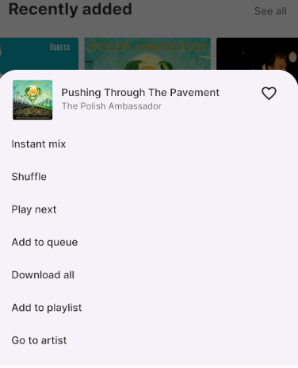
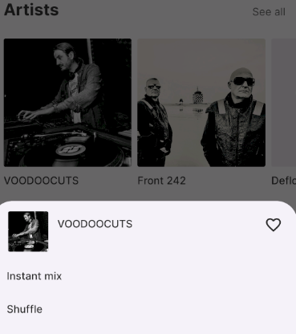

# App Name Usage Guide 
[<- back home](README.md)

## Table of Contents
- [Prerequisites](#prerequisites)
- [Getting Started](#getting-started)
- [Server Configuration](#server-configuration)
- [Main Features](#main-features)
- [Navigation](#navigation)
- [Playback Controls](#playback-controls)
- [Favorites](#favorites)
- [Playlist Management](#playlist-management)
- [Android Auto](#android-auto)
- [Settings](#settings)
- [Troubleshooting](#troubleshooting)

## Prerequisites

**Important Notice**: This app is a Subsonic-compatible client and does not provide any music content itself. To use this application, you must have:

- An active Subsonic API server (or compatible service) already set up
- Valid login credentials for your Subsonic server
- Music content uploaded and organized on your server

### Verified backends
This app works with any service that implements the Subsonic API, including:
- [LMS - Lightweight Music Server](https://github.com/epoupon/lms) -  *personal fave and my backend*
- [Navidrome](https://www.navidrome.org/)
- [Gonic](https://github.com/sentriz/gonic)

## Getting Started

### Installation
1. Download the APK from the [Releases](https://github.com/eddyizm/tempo/releases) section
2. Enable "Install from unknown sources" in your Android settings
3. Install the application

### First Launch
1. Open the application
2. You will be prompted to configure your server connection
3. Grant necessary permissions for media playback and background operation

## Server Configuration

### Initial Setup
**IN PROGRESS**
1. Enter your server URL (e.g., `https://your-subsonic-server.com`)
2. Provide your username and password
3. Test the connection to ensure proper configuration

### Advanced Settings
**TODO**

## Main Features

### Library View
**TODO**

### Now Playing Screen
**TODO**

## Navigation

### Bottom Navigation Bar
**IN PROGRESS**
- **Home**: Recently played and server recommendations
- **Library**: Your server's complete music collection
- **Download**: Locally downloaded files from server 

## Playback Controls

### Streaming Controls
**TODO**

### Advanced Controls
**TODO**

## Favorites

### Favorites (aka heart aka star) to albums and artists
- Long pressing on an album gives you access to heart/unheart an album   

    

- Long pressing on an artist cover gets you the same access to to heart/unheart an album   

    

## Playlist Management

### Server Playlists
**TODO**

### Creating Playlists
**TODO**

## Settings

## Android Auto

### Enabling on your head unit
- You have to enable Android Auto developer options, which are different from actual Android dev options. Then you have to enable "Unknown sources" in Android Auto, otherwise the app won't appear as it isn't downloaded from Play Store. (screenshots needed)

### Server Settings
**IN PROGRESS**
- Manage multiple server connections
- Configure sync intervals
- Set data usage limits for streaming

### Audio Settings
**IN PROGRESS**
- Streaming quality settings
- Offline caching preferences

### Appearance
**TODO**

## Troubleshooting

### Connection Issues

**TODO**

### Common Issues

**TODO**

### Support
For additional help:
- Question? Start a [Discussion](https://github.com/eddyizm/tempo/discussions)
- Open an [issue](https://github.com/eddyizm/tempo/issues) if you don't find a discussion solving your issue. 
- Consult your Subsonic server's documentation

---

*Note: This app requires a pre-existing Subsonic-compatible server with music content.*